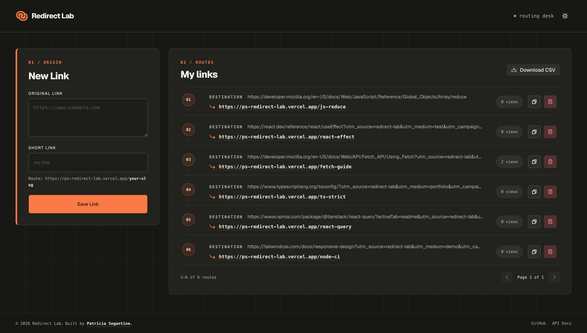

# Redirect Lab — Client
A focused link-management experience for creating, tracking, sharing, and exporting short URLs.



## Overview

Redirect Lab is a full-stack URL shortener built around a simple idea: link management should feel immediate, reliable, and pleasantly uneventful. The client provides a responsive interface for the entire link lifecycle, from creating a memorable slug to monitoring access counts and exporting the link collection as CSV.

The application communicates with the standalone Redirect Lab API and keeps the interface in sync when a short link is accessed in another browser tab.

[Live application](https://ps-redirect-lab.vercel.app/) -
[Server repository](https://github.com/patriciasegantine/redirect-lab-server)

### What you can do

- Create validated short links with custom slugs
- Copy and open generated URLs directly from the dashboard
- Track access counts with cross-tab updates
- Delete links with contextual loading and success/error feedback
- Export the complete link collection as CSV
- Switch between light and dark themes
- Navigate with accessible labels, dialogs, focus states, and form feedback

## Background

Redirect Lab started as [Brev.ly](https://github.com/patriciasegantine/brev.ly), developed during a postgraduate course to explore full-stack development and AWS. After the course ended, the original monorepo became the foundation for a broader personal project: the application was rebranded, the client and server were split into independent repositories, and new features were layered on top.

The infrastructure choices shifted deliberately toward low-cost or free-tier services: Neon for serverless PostgreSQL, Railway for server deployment, Cloudflare R2 for object storage, and Vercel for the client. This makes the project practical to run and iterate on outside of a classroom or enterprise environment.

This repository contains the React client. The backend, API contracts, persistence layer, and CSV export pipeline live in the [Redirect Lab server repository](https://github.com/patriciasegantine/redirect-lab-server).

## How it works

1. The client validates the destination URL and custom slug before sending them to the API.
2. React Query keeps the link collection and mutation states synchronized with the server.
3. Visiting a short URL resolves its destination, records the access, and redirects the visitor.
4. A browser channel notifies open dashboard tabs so access counts can be refreshed.
5. CSV exports are generated by the server and delivered through object storage.

## Tech stack

| Area | Technologies |
| --- | --- |
| Core | React 19, TypeScript, Vite |
| Routing and data | React Router, TanStack Query, Axios |
| Forms and validation | React Hook Form, Zod |
| UI | Tailwind CSS, shadcn/ui, Radix UI, Phosphor Icons |
| Quality | Vitest, Testing Library, axe-core, ESLint, Prettier |
| Delivery | GitHub Actions, Vercel |

## Project structure

```text
src/
├── components/   # Pages, layouts, feature components, and UI primitives
├── hooks/        # Server-state and application hooks
├── services/     # API client and endpoint integrations
├── schema/       # Form and domain validation
├── lib/          # Shared browser and utility modules
├── types/        # TypeScript domain types
└── test/         # Shared test setup
```

## Running locally

### Requirements

- Node.js 22+
- npm
- A running instance of the [Redirect Lab API](https://github.com/patriciasegantine/redirect-lab-server)

### Setup

```bash
npm install
cp .env.example .env
npm run dev
```

The development server runs at `http://localhost:5173`.

### Environment variables

```dotenv
VITE_FRONTEND_URL=http://localhost:5173
VITE_BACKEND_URL=http://localhost:3333
```

| Variable | Purpose |
| --- | --- |
| `VITE_FRONTEND_URL` | Public client URL used to build and display short links |
| `VITE_BACKEND_URL` | Base URL for the Redirect Lab API |

## Available scripts

| Command | Description |
| --- | --- |
| `npm run dev` | Start the Vite development server |
| `npm run build` | Type-check and create a production build |
| `npm run preview` | Preview the production build locally |
| `npm run lint` | Run ESLint |
| `npm run format` | Format TypeScript and TSX files with Prettier |
| `npm run typecheck` | Run TypeScript checks without emitting files |
| `npm run test` | Run the Vitest suite in watch mode |
| `npm run test:coverage` | Generate the test coverage report |
| `npm run pre-pr` | Run lint, tests, and a production build |

## Delivery and quality

Pull requests run automated tests, type-checking, and linting through GitHub Actions. Vercel's Git integration creates preview deployments for branches and deploys changes merged into `main` to production.

The component suite includes behavioral and accessibility tests, with Testing Library and axe-core covering the user-facing flows rather than implementation details.

## What's next

- **Access dashboard**: charts showing clicks over time, with last-access date per link
- **QR Code generation**: client-side QR Code per link with PNG download
- **Link expiration**: optional expiry date on creation, with a distinct expired state in the UI
- **UTM builder**: optional UTM fields on the creation form with a live URL preview

## License

This project is licensed under the [MIT License](LICENSE).

## Author

Created by **Patricia Segantine** — Senior Frontend Developer

[LinkedIn](https://linkedin.com/in/patriciasegantine) · [Portfolio](https://patriciasegantine.vercel.app/)
